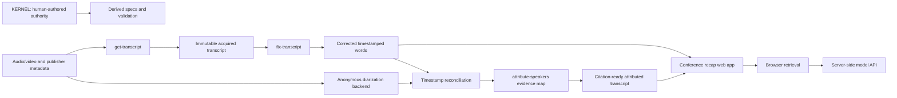
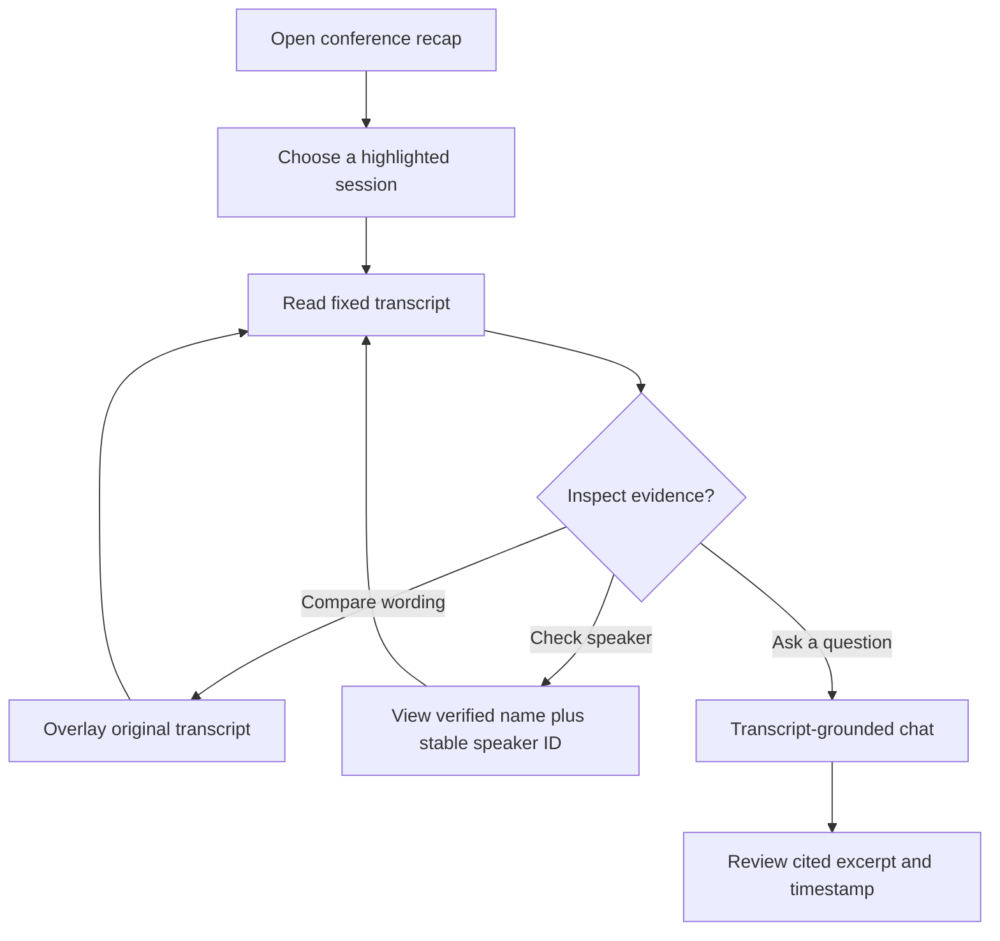

# Architecture

The repository separates immutable human-authored requirements, transcript
evidence preparation, and the browser application that presents conference
lessons with transcript-grounded retrieval.

## System design

Transcript responsibilities are intentionally non-overlapping:

- `get-transcript` owns acquisition and source provenance.
- `fix-transcript` owns proposed and verified word corrections.
- `attribute-speakers` owns anonymous speaker labels, identity evidence, and
  citation-safe rendering. It cannot change words or timestamps.

The app keeps the API key server-side, retrieves relevant transcript passages in
the browser, and sends only selected excerpts to the allowed model endpoint.

## User journey

Speaker identities that are not verified remain anonymous in citation-ready
output. Review-only output may show a candidate name with an explicit question
mark.
