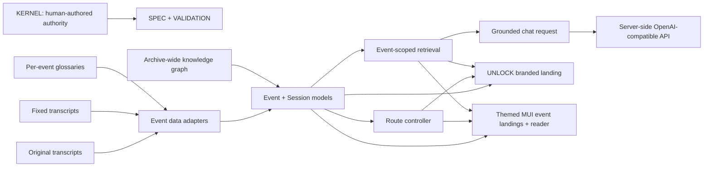
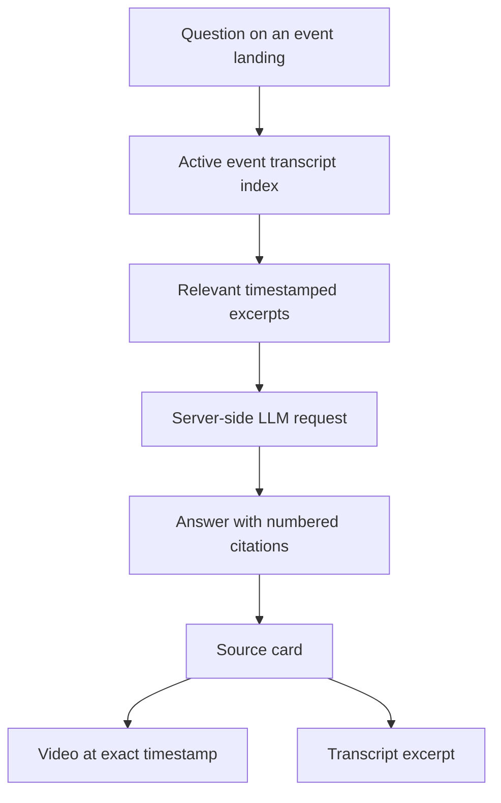
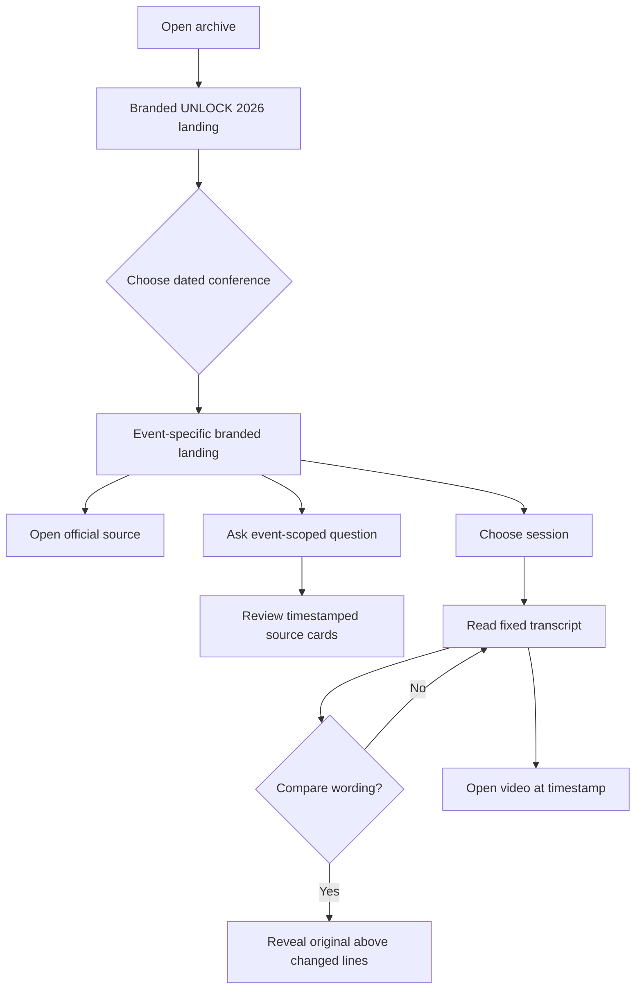

# Architecture

The repository separates immutable human-authored requirements, event data,
domain behavior, routing, and MUI presentation. `KERNEL/` is authoritative;
`SPEC/` and `VALIDATION/` record the derived interpretation and proof
obligations.

## System design

The browser never receives provider credentials or selects a model. It sends
only the question, short conversation history, and retrieved transcript
excerpts to the shared `/api/openai/chat/completions` endpoint. The backend
supplies credentials and model configuration.

### Layers

- `app/src/models/` defines the event and session domain.
- `app/src/data/` adapts immutable transcript and glossary artifacts into that
  domain and exports the merged knowledge graph.
- `app/src/controllers/` owns URL parsing and internal path construction.
- `app/src/lib/` owns retrieval, chat request construction, and transcript
  comparison behavior.
- `app/src/views/` contains two presentation paths over the same domain model:
  `UnlockLandingPage.tsx` restores the conference's bespoke editorial design,
  while `EventLandingPage.tsx` selects the WorkOS, AI Engineer, or neutral MUI
  presentation variant and `TranscriptView.tsx` provides the shared reader.
- `app/src/views/navigation.tsx` owns the prominent shared conference selector,
  including date-qualified option labels and event-scoped route transitions.

UNLOCK 2026 is the root event. Other events use `/events/:eventId`, while the
legacy `/talk/:sessionId` route continues to open UNLOCK sessions.

## Grounding and evidence

Retrieval begins after the transcript metadata delimiter. A declared segment
start, such as WorkOS `57:12`, becomes the timestamp for body text that appears
before the first ordinary caption marker.

## User journey

The reader defaults to corrected wording, keeps both transcript versions
downloadable, and uses the browser's vertical scroll rather than nested
transcript scroll areas.
